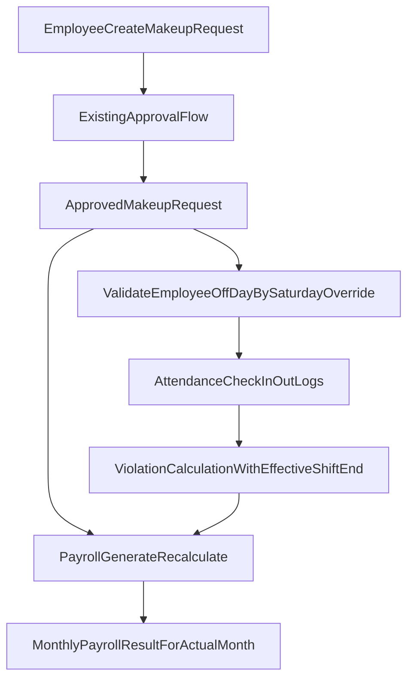

# Kế hoạch triển khai chức năng làm bù

## Mục tiêu nghiệp vụ đã chốt

- Nhân viên đi muộn có thể làm bù bằng cách kéo dài giờ tan ca; nếu checkout trước giờ kết thúc trong phiếu làm bù thì xử lý vi phạm theo cơ chế hiện tại.
- Nhân viên nghỉ làm có thể làm bù vào ngày nghỉ của chính nhân viên đó.
- Phiếu `late_early_makeup` (đi muộn/về sớm làm bù) chỉ được tạo và thực hiện trong cùng tháng với ngày thiếu công gốc (không cho bù sang tháng sau).
- Phiếu `full_day_makeup` (làm bù cả ngày) được phép làm bù tháng sau và ghi nhận vào tháng thực tế làm bù (không hồi tố tháng cũ).
- Mọi phiếu làm bù bắt buộc liên kết ngày thiếu công gốc.
- Luồng duyệt của phiếu tiếp tục dùng cấu hình duyệt hiện tại của hệ thống.

## Phạm vi thay đổi chính

- **Loại phiếu mới + dữ liệu liên kết ngày gốc**
  - Thêm 2 request type mới trong seed/migration:
    - `late_early_makeup` ("đi muộn/về sớm làm bù")
    - `full_day_makeup` ("làm bù cả ngày")
  - Bổ sung dữ liệu bắt buộc để link ngày thiếu công gốc (trong `employee_requests.custom_data` theo key chuẩn hóa), và validate bắt buộc ở server action.
  - File liên quan: [scripts/018-request-types.sql](scripts/018-request-types.sql), [lib/actions/request-type-actions.ts](lib/actions/request-type-actions.ts), [components/leave/leave-request-panel.tsx](components/leave/leave-request-panel.tsx)
- **Ràng buộc ngày làm bù hợp lệ (chỉ ngày nghỉ của nhân viên)**
  - Reuse logic override thứ 7 hiện có để xác định ngày nghỉ theo từng nhân viên:
    - bảng `saturday_work_schedule` + hàm `isSaturdayOff(...)` theo employee.
  - Rule rõ phạm vi ngày nghỉ dùng cho làm bù:
    - chỉ dùng lịch làm việc/ca làm của nhân viên + override thứ 7;
    - không dùng `special_work_days` (ngày làm việc đặc biệt như bão/sự kiện/cho về sớm) để mở rộng quyền làm bù.
  - Validate khi tạo/cập nhật phiếu:
    - `request_date` (ngày làm bù) phải là ngày nghỉ của đúng nhân viên.
    - Không cho phép chọn ngày làm việc bình thường.
  - File liên quan: [lib/actions/saturday-schedule-actions.ts](lib/actions/saturday-schedule-actions.ts), [components/attendance/attendance-management-panel.tsx](components/attendance/attendance-management-panel.tsx), [lib/actions/request-type-actions.ts](lib/actions/request-type-actions.ts)
- **Áp dụng giờ tan ca theo phiếu làm bù để kiểm tra vi phạm**
  - Mở rộng `getEmployeeViolations()` để đọc phiếu `late_early_makeup` đã duyệt theo ngày.
  - Thêm validate tạo/cập nhật phiếu `late_early_makeup`: `request_date` và `linked_deficit_date` phải cùng tháng-năm.
  - Nếu có phiếu hợp lệ cho ngày đó:
    - nâng `effectiveShiftEnd` lên `to_time` của phiếu;
    - checkout trước mốc này => vi phạm như hiện tại.
  - Giữ nguyên hành vi xử lý vi phạm hiện có (không thêm kiểu phạt mới).
  - File liên quan: [lib/actions/payroll/violations.ts](lib/actions/payroll/violations.ts)
- **Tích hợp làm bù cả ngày và làm bù tháng sau vào tính công/lương**
  - Bổ sung bước map thiếu công gốc <-> ngày làm bù thực tế dựa trên liên kết bắt buộc trong phiếu.
  - Với `full_day_makeup` đã duyệt + attendance hợp lệ ngày làm bù:
    - ghi nhận ngày làm bù vào tháng thực tế;
    - dùng dữ liệu liên kết để tránh tính thiếu lặp (double penalty) trong kỳ xử lý.
  - Cập nhật luồng generate/recalculate payroll để nhận diện phiếu làm bù khi tạo adjustment.
  - File liên quan: [lib/actions/payroll/generate-payroll.ts](lib/actions/payroll/generate-payroll.ts), [lib/actions/payroll/recalculate-single.ts](lib/actions/payroll/recalculate-single.ts), [lib/actions/payroll/working-days-utils.ts](lib/actions/payroll/working-days-utils.ts)
- **Xử lý conflict làm bù và OT (không double count)**
  - Áp dụng nguyên tắc: `1 phút chỉ thuộc 1 loại công` (`regular` | `makeup` | `ot`).
  - Với `late_early_makeup`:
    - interval dùng để bù chỉ tính `makeup`;
    - `ot` chỉ bắt đầu sau mốc kết thúc bù.
  - Với `full_day_makeup` trong ngày nghỉ:
    - số giờ tương đương 1 ngày công chuẩn tính `makeup`;
    - giờ vượt chuẩn mới tính `ot`.
  - Validate cứng khi tạo/duyệt:
    - chặn overlap thời gian giữa phiếu OT và phiếu makeup;
    - chuẩn hóa interval trước khi tính payroll để tránh trùng từ nhiều nguồn OT (`employee_requests` và `overtime_records`).
  - File liên quan: [lib/actions/request-type-actions.ts](lib/actions/request-type-actions.ts), [lib/actions/overtime-actions.ts](lib/actions/overtime-actions.ts), [lib/actions/payroll/generate-payroll.ts](lib/actions/payroll/generate-payroll.ts), [lib/actions/payroll/recalculate-single.ts](lib/actions/payroll/recalculate-single.ts)
- **UI phiếu làm bù**
  - Trong form tạo phiếu, khi chọn 2 loại phiếu làm bù:
    - hiển thị trường bắt buộc chọn `ngày thiếu công gốc`;
    - với phiếu giờ: nhập `from_time/to_time` rõ ràng;
    - cảnh báo rule "checkout trước giờ phiếu là vi phạm".
  - Tại màn danh sách/chi tiết phiếu: hiển thị ngày gốc và ngày làm bù để đối soát.
  - File liên quan: [components/leave/leave-request-panel.tsx](components/leave/leave-request-panel.tsx), [components/leave/leave-approval-panel.tsx](components/leave/leave-approval-panel.tsx)

## Dòng chảy nghiệp vụ sau khi triển khai

## Kiểm thử cần có

- Unit cho validate server action:
  - bắt buộc `linked_deficit_date`;
  - từ chối ngày làm bù không phải ngày nghỉ của nhân viên.
- Unit cho vi phạm:
  - có `late_early_makeup` approved, checkout trước `to_time` => vẫn vi phạm;
  - checkout đúng/sau `to_time` => không vi phạm về sớm.
- Payroll integration:
  - phiếu `late_early_makeup` khác tháng với `linked_deficit_date` bị từ chối ngay từ khâu tạo phiếu;
  - full-day makeup ở tháng sau được ghi nhận tháng sau;
  - ngày có cả OT và makeup chỉ được tính mỗi phút đúng 1 bucket, không tính đồng thời makeup+OT cho cùng interval;
  - không double count thiếu công khi đã có phiếu làm bù hợp lệ.

## Lưu ý kỹ thuật quan trọng

- Hiện payroll working-days đang dùng rule thứ 7 mặc định; cần đồng bộ với override nhân viên để tránh lệch giữa attendance và payroll.
- `request_types` đang là cấu hình động; ưu tiên thêm loại phiếu qua migration seed và giữ tương thích dữ liệu cũ.

