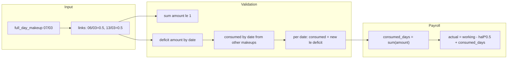

# Kế hoạch: 1 makeup consume nhiều deficit (theo amount)

## Bối cảnh

- **Case:** 2 ca sáng thiếu (06/03 và 13/03, mỗi ngày 0.5) → 1 ngày làm bù 07/03 → consume 0.5 + 0.5 = 1 ngày.
- **Hiện tại:** [lib/utils/makeup-utils.ts](lib/utils/makeup-utils.ts) và [lib/actions/payroll/generate-payroll.ts](lib/actions/payroll/generate-payroll.ts) dùng `custom_data.linked_deficit_date` (1 ngày), `consumed_days = consumedDeficitDates.size` (đếm số ngày, mỗi ngày = 1). Không hỗ trợ 1 makeup bù nhiều nửa ngày.

## Nguyên tắc

- **Consume theo amount:** `consumed_days` = tổng **amount** đã consume (0.5 + 0.5 = 1), không phải đếm số ngày.
- **Rule:** Không over-consume: với mỗi `deficit_date`, tổng amount các makeup đã duyệt (có chấm công) ≤ deficit amount ngày đó (0.5 hoặc 1 từ violations).
- **Capacity makeup:** Tổng amount của 1 phiếu full_day_makeup ≤ 1.

### Bản chất: Makeup = consume deficit (không tạo công)

- **Ngày làm bù (request_date)** không tăng công: ngày 07/03 không cộng vào `working_days`.
- Makeup chỉ **xóa deficit** của các **ngày gốc** (deficit_date): 07/03 consume deficit của 06/03 và 13/03.
- Consume luôn tính theo **ngày gốc** (deficit_date), không theo ngày makeup. Payroll: bị trừ theo deficit (halfDays × 0.5), được cộng lại theo `consumed_days` (tổng amount đã consume) → net đúng.

### Remaining deficit (để validation, UI, debug)

- Với mỗi ngày có deficit: `remaining[date] = deficitAmount[date] - consumedAmount[date]`.
- `deficitAmount[date]`: từ violations (0.5 nếu isHalfDay, 1 nếu isAbsent, 0 nếu không thiếu).
- `consumedAmount[date]`: tổng amount từ các phiếu full_day_makeup đã duyệt **và có chấm công ngày làm bù**.
- Dùng remaining để: validation (link mới chỉ được thêm nếu link.amount ≤ remaining[date]), UI hiển thị “còn thiếu bao nhiêu”, debug payroll.

### Rule bắt buộc: Có chấm công ngày làm bù mới được consume

- Nếu **không có** attendance (check_in/check_out) trên **ngày làm bù** (request_date) thì phiếu full_day_makeup **không được** tính vào consumed_days.
- Trong payroll: chỉ cộng amount của request khi `attendanceDates.has(request.request_date)`.
- Logic: `if (!hasAttendance(makeup_date)) { không consume }`.

---

## 1. Data model

**Chọn phương án lưu trong `custom_data` (không thêm bảng mới):**

- Giữ tương thích ngược: nếu có `linked_deficit_date` (string) và không có `linked_deficit_links` → coi như 1 link với amount = 1.
- Thêm (hoặc dùng thay thế) cho full_day_makeup:
  - `linked_deficit_links`: mảng `{ deficit_date: string, amount: number }[]`, mỗi amount là 0.5 hoặc 1, tổng ≤ 1.

Ví dụ cho case 06/03 + 13/03:

```json
"linked_deficit_links": [
  { "deficit_date": "2026-03-06", "amount": 0.5 },
  { "deficit_date": "2026-03-13", "amount": 0.5 }
]
```

- **Chuẩn hóa khi đọc:** Helper `getMakeupDeficitLinks(custom_data)`: nếu có `linked_deficit_links` (và length > 0) trả về đó; nếu chỉ có `linked_deficit_date` trả về `[{ deficit_date: value, amount: 1 }]`. Mọi chỗ dùng deficit từ makeup đều đi qua helper này.

**Thay thế (nếu muốn chuẩn hóa DB):** Bảng `makeup_deficit_links (id, employee_request_id, deficit_date, amount)` với unique(employee_request_id, deficit_date). Khi đó form gửi N dòng, backend ghi N bản ghi và đọc khi tính payroll/validation. Plan dưới giả định dùng custom_data; nếu chuyển sang bảng thì chỉ đổi nơi đọc/ghi, logic validation và payroll giữ nguyên.

---

## 2. Payroll: consumed_days theo amount

**File:** [lib/actions/payroll/generate-payroll.ts](lib/actions/payroll/generate-payroll.ts), [lib/actions/payroll/recalculate-single.ts](lib/actions/payroll/recalculate-single.ts).

- Thay vì `Set<string>` (consumedDeficitDates), dùng cấu trúc tính **tổng amount**:
  - Duyệt từng request full_day_makeup đã duyệt, có `request_date` và có chấm công ngày đó.
  - Với mỗi request: lấy links từ `getMakeupDeficitLinks(request.custom_data)`; cộng tổng `amount` của request đó vào `consumed_days`.
- Công thức giữ nguyên: `actualAttendanceDays = workingDaysCount - (halfDays * 0.5) + consumed_days` (consumed_days giờ là số thực, VD 0.5+0.5=1).
- **consumed_deficit_detail (audit):** Lưu dạng có amount, VD `2026-03-06:0.5,2026-03-13:0.5` (để biết bù những ngày nào, bao nhiêu). Có thể build từ cùng nguồn khi tính consumed_days (tập hợp các cặp deficit_date + amount đã consume trong tháng).
- **Chỉ consume khi có chấm công ngày làm bù:** Chỉ những request có `request_date` nằm trong `attendanceDates` mới được cộng amount vào consumed_days; không có log chấm công ngày makeup → không consume.

---

## 3. Validation khi tạo/cập nhật phiếu full_day_makeup

**File:** [lib/actions/request-type-actions.ts](lib/actions/request-type-actions.ts) (và nếu có validate trong [lib/actions/**tests**/makeup-validation.test.ts](lib/actions/__tests__/makeup-validation.test.ts)).

- **Input:** Với full_day_makeup, nhận `linked_deficit_links: { deficit_date, amount }[]` (hoặc từ form gửi nhiều cặp ngày + amount). Nếu client vẫn gửi 1 `linked_deficit_date` thì convert thành 1 link amount 1.
- **Rule 1 – Capacity:** `sum(link.amount) <= 1`.
- **Rule 2 – Amount hợp lệ:** Mỗi `amount` ∈ { 0.5, 1 } (có thể cho phép 0.25 nếu sau này hỗ trợ).
- **Rule 3 – Không over-consume theo ngày:**
  - Với mỗi `deficit_date` trong request, cần biết: (1) deficit amount của ngày đó (từ violations: 0.5 nếu isHalfDay, 1 nếu isAbsent, 0 nếu không thiếu); (2) đã consumed cho ngày đó bởi các phiếu full_day_makeup đã duyệt khác (tính từ `getMakeupDeficitLinks` của từng phiếu).
  - Gọi `getEmployeeViolations` cho khoảng chứa các deficit_date (hoặc chỉ các ngày trong links) để lấy deficit amount theo ngày: `deficitAmount[date] = 0.5` nếu isHalfDay, `1` nếu isAbsent, `0` nếu không.
  - Đã consumed: duyệt tất cả full_day_makeup đã duyệt của nhân viên (có thể bỏ qua request đang sửa khi update), với mỗi link cộng `amount` vào `consumedByDate[deficit_date]`.
  - Với mỗi link trong request mới: `consumedByDate[deficit_date] + link.amount <= deficitAmount[deficit_date]`. Nếu deficit_amount = 0 (ngày không thiếu) thì từ chối link đó.
- **Rule 4 – Ngày làm bù off-day, giờ, trùng OT:** Giữ nguyên như hiện tại (full_day_makeup off-day, from_time/to_time, conflict OT).
- **Over-consume = remaining:** Có thể diễn đạt Rule 3 bằng remaining: với mỗi link, `link.amount <= remaining[deficit_date]` (remaining = deficitAmount - consumedByDate từ các makeup khác đã approved). Nếu remaining = 0 thì không cho thêm link vào ngày đó.

---

## 4. Trùng / “đã bù” khi tạo phiếu

- **Hiện tại:** Kiểm tra “mỗi linked_deficit_date chỉ được bù một lần” (1-1) → từ chối nếu đã có phiếu approved cùng linked_deficit_date.
- **Mới:** Không còn “1 deficit chỉ 1 phiếu”; cho phép nhiều phiếu cùng link vào 1 deficit_date, nhưng **tổng amount** không vượt quá deficit của ngày đó (đã xử lý ở Rule 3). Bỏ check “alreadyConsumed for this date = full” nếu đã dùng Rule 3 (chỉ cần đảm bảo consumedByDate[date] + new amount <= deficitAmount[date]).

---

## 5. UI form full_day_makeup

**File:** [components/leave/leave-request-panel.tsx](components/leave/leave-request-panel.tsx).

- Thay 1 ô “Ngày thiếu công gốc” bằng **danh sách (Ngày thiếu công gốc + Số ngày)**:
  - Mỗi dòng: 1 input date + 1 select/input amount (0.5 hoặc 1); nút xóa dòng.
  - Nút “Thêm ngày thiếu công” (thêm dòng).
  - Tổng amount hiển thị và bắt buộc ≤ 1.
  - Submit: gửi `linked_deficit_links: [{ deficit_date, amount }, ...]` (và có thể không gửi `linked_deficit_date` nữa, hoặc gửi dòng đầu để tương thích nếu backend vẫn đọc cũ).
- Khi edit: load từ `custom_data.linked_deficit_links` (hoặc từ `linked_deficit_date` → 1 dòng amount 1).
- **Gợi ý (phase 2):** Auto FIFO – gợi ý danh sách deficit theo ngày cũ nhất trước, để user không bỏ sót (VD: 3 ngày thiếu 01/03, 05/03, 10/03; làm bù 1 ngày → gợi ý 01+05 thay vì 05+10).

---

## 6. Edge cases (cần cover trong plan / code)


| Case                               | Mô tả                                                               | Cách xử lý                                                                                                                    |
| ---------------------------------- | ------------------------------------------------------------------- | ----------------------------------------------------------------------------------------------------------------------------- |
| **A. 1 ngày bù 2 lần**             | 06/03 thiếu 0.5; Makeup A consume 0.5; Makeup B cũng link 06/03 0.5 | B phải fail: Rule 3 (remaining[06/03] = 0 sau A) → không cho thêm amount cho 06/03.                                           |
| **B. Makeup chưa chấm công**       | Phiếu full_day_makeup đã duyệt nhưng ngày làm bù không có log       | Không consume: trong payroll chỉ cộng amount khi `attendanceDates.has(request_date)`.                                         |
| **C. Makeup > 1 ngày (tương lai)** | Cho phép 1 phiếu bù 2 ngày (sum amount ≤ 2)                         | Hiện fix sum ≤ 1; sau nếu mở rộng: support sum(amount) ≤ 2 và 2 request_date (hoặc 1 request_date = 2 ngày) – ghi chú future. |


---

## 7. Cập nhật doc và test

- [docs/makeup-work-cases.md](docs/makeup-work-cases.md): Thêm case “1 makeup bù 2 nửa ngày (06/03 + 13/03)”, mô tả linked_deficit_links, rule sum(amount) ≤ 1 và no over-consume; cập nhật công thức consumed_days = tổng amount.
- Test: Unit/request test cho validation (sum ≤ 1; over-consume từ chối; payload linked_deficit_links). Test payroll: 1 makeup 2 links 0.5+0.5 → consumed_days = 1, actual = X - 1 + 1 = X.

---

## 8. Thứ tự triển khai gợi ý

1. **Helper và data:** Thêm `getMakeupDeficitLinks(custom_data)` trong [lib/utils/makeup-utils.ts](lib/utils/makeup-utils.ts); định nghĩa type/constant cho `linked_deficit_links` key.
2. **Payroll:** Sửa generate-payroll và recalculate-single: consumed_days = tổng amount từ getMakeupDeficitLinks; consumed_deficit_detail dạng "date:amount"; giữ backward compat với linked_deficit_date.
3. **Validation:** Trong request-type-actions, nhận linked_deficit_links; kiểm tra capacity, amount hợp lệ, và no over-consume (dùng violations + existing makeups); bỏ/điều chỉnh check “đã bù một lần” cho từng date.
4. **UI:** Form full_day_makeup nhiều dòng deficit + amount; submit linked_deficit_links.
5. **Doc + test:** Cập nhật makeup-work-cases.md và test validation/payroll.

---

## Sơ đồ luồng (tóm tắt)




---

## Lưu ý

- **late_early_makeup:** Giữ 1-1 (một ngày thiếu, một ngày làm bù); không cần linked_deficit_links cho loại này; chỉ áp dụng N-N cho full_day_makeup.
- **FIFO (ưu tiên cũ nhất):** Phase 1 = user chọn tay linked_deficit_links. Phase 2 (nên có): auto-suggest theo ngày cũ nhất trước để tránh bỏ sót deficit cũ (VD 01/03, 05/03, 10/03 thiếu → gợi ý 01+05 thay vì 05+10).
- **Tóm tắt case chuẩn:** 2 half-day deficit (06/03 + 13/03) → 1 full-day makeup (07/03) với links 0.5+0.5 → consumed_days = 1 → actual = workingDays - 1 + 1 = không bị trừ công.

