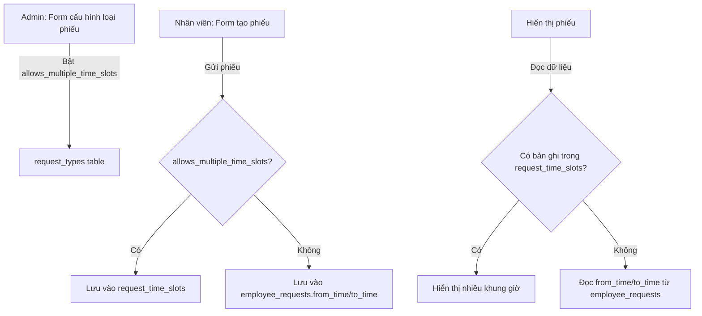
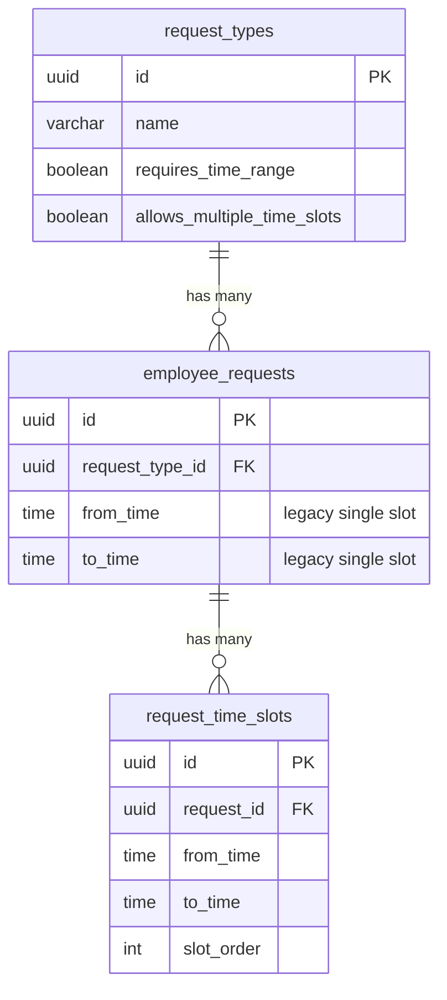

# Tài liệu Thiết kế: Nhiều khung giờ trong 1 phiếu

## Tổng quan

Tính năng mở rộng hệ thống phiếu yêu cầu hiện tại để hỗ trợ nhiều khung giờ (time slots) trong cùng một phiếu. Thay vì chỉ lưu một cặp `from_time`/`to_time` trên bảng `employee_requests`, hệ thống sẽ thêm bảng con `request_time_slots` để lưu nhiều khung giờ. Cấu hình loại phiếu sẽ có thêm cờ `allows_multiple_time_slots` để admin bật/tắt tính năng này cho từng loại phiếu.

Thiết kế đảm bảo tương thích ngược hoàn toàn: các phiếu cũ vẫn đọc từ `from_time`/`to_time` trên `employee_requests`, các loại phiếu không bật tính năng mới vẫn hoạt động như cũ.

## Kiến trúc



### Luồng xử lý chính

1. **Cấu hình**: Admin bật `allows_multiple_time_slots` trên loại phiếu → hệ thống tự động bật `requires_time_range`
2. **Tạo phiếu**: Nhân viên thêm nhiều khung giờ → frontend validate → server action lưu vào `request_time_slots`
3. **Hiển thị**: Hệ thống kiểm tra `request_time_slots` trước, fallback về `employee_requests.from_time/to_time`
4. **Sửa phiếu**: Load khung giờ từ `request_time_slots` (hoặc fallback) → hiển thị trên form

## Thành phần và Giao diện

### 1. Database Migration

Thêm cột `allows_multiple_time_slots` vào bảng `request_types` và tạo bảng `request_time_slots`.

### 2. TypeScript Types (lib/types/database.ts)

Cập nhật interface `RequestType` thêm trường `allows_multiple_time_slots` và tạo interface `RequestTimeSlot`.

```typescript
// Thêm vào RequestType
export interface RequestType {
  // ... existing fields
  allows_multiple_time_slots: boolean
}

// Interface mới
export interface RequestTimeSlot {
  id: string
  request_id: string
  from_time: string
  to_time: string
  slot_order: number
  created_at: string
}
```

### 3. Form cấu hình loại phiếu (request-type-management.tsx)

Thêm toggle switch cho `allows_multiple_time_slots` trong phần "Cấu hình trường nhập", ngay dưới toggle `requires_time_range`. Logic liên kết:
- Bật `allows_multiple_time_slots` → tự động bật `requires_time_range`
- Tắt `requires_time_range` → tự động tắt `allows_multiple_time_slots`

### 4. Form tạo/sửa phiếu (leave-request-panel.tsx)

Khi loại phiếu có `allows_multiple_time_slots = true`:
- Hiển thị danh sách khung giờ thay vì một cặp `from_time`/`to_time` đơn
- Mỗi khung giờ có nút xóa (trừ khung giờ đầu tiên nếu chỉ còn 1)
- Nút "Thêm khung giờ" ở cuối danh sách
- Validation: kiểm tra `from_time < to_time` và không chồng chéo

```
┌─────────────────────────────────┐
│ Khung giờ 1                     │
│ [Từ giờ: 06:00] [Đến giờ: 08:00] [🗑]│
│                                 │
│ Khung giờ 2                     │
│ [Từ giờ: 17:00] [Đến giờ: 20:00] [🗑]│
│                                 │
│ [+ Thêm khung giờ]             │
└─────────────────────────────────┘
```

### 5. Server Actions (request-type-actions.ts)

Cập nhật các hàm:
- `createRequestType` / `updateRequestType`: hỗ trợ trường `allows_multiple_time_slots`
- `createEmployeeRequest` / `updateEmployeeRequest`: nhận thêm param `time_slots` array, lưu vào `request_time_slots`
- `getMyEmployeeRequests` / `listEmployeeRequests`: join thêm `request_time_slots` khi query
- Thêm hàm helper `getRequestTimeSlots(requestId)` để lấy khung giờ

### 6. Hiển thị phiếu

- Danh sách phiếu: hiển thị tất cả khung giờ dạng "06:00-08:00, 17:00-20:00"
- Chi tiết phiếu: hiển thị từng khung giờ trên dòng riêng
- Logic fallback: nếu không có bản ghi trong `request_time_slots`, đọc `from_time`/`to_time` từ `employee_requests`

## Mô hình Dữ liệu

### Bảng mới: request_time_slots

```sql
CREATE TABLE request_time_slots (
  id UUID PRIMARY KEY DEFAULT gen_random_uuid(),
  request_id UUID NOT NULL REFERENCES employee_requests(id) ON DELETE CASCADE,
  from_time TIME NOT NULL,
  to_time TIME NOT NULL,
  slot_order INT NOT NULL DEFAULT 0,
  created_at TIMESTAMPTZ DEFAULT now(),
  
  CONSTRAINT fk_request FOREIGN KEY (request_id) 
    REFERENCES employee_requests(id) ON DELETE CASCADE,
  CONSTRAINT chk_time_order CHECK (from_time < to_time)
);

CREATE INDEX idx_request_time_slots_request_id ON request_time_slots(request_id);
```

### Cột mới trên request_types

```sql
ALTER TABLE request_types 
  ADD COLUMN allows_multiple_time_slots BOOLEAN DEFAULT false;
```

### Quan hệ dữ liệu



### Chiến lược đọc dữ liệu (Fallback)

```
getTimeSlots(requestId):
  1. Query request_time_slots WHERE request_id = requestId ORDER BY slot_order
  2. IF results.length > 0 → return results
  3. ELSE → read from_time, to_time from employee_requests
     → return [{ from_time, to_time, slot_order: 0 }]
```


## Thuộc tính Đúng đắn (Correctness Properties)

*Thuộc tính đúng đắn là một đặc điểm hoặc hành vi phải luôn đúng trong mọi lần thực thi hợp lệ của hệ thống — về cơ bản là một phát biểu hình thức về những gì hệ thống phải làm. Các thuộc tính này là cầu nối giữa đặc tả mà con người đọc được và đảm bảo tính đúng đắn mà máy có thể kiểm chứng.*

### Property 1: Bất biến liên kết cấu hình toggle

*Với mọi* trạng thái cấu hình loại phiếu, nếu `allows_multiple_time_slots` là `true` thì `requires_time_range` cũng phải là `true`. Nói cách khác, không tồn tại trạng thái hợp lệ nào mà `allows_multiple_time_slots = true` và `requires_time_range = false`.

**Validates: Requirements 1.2, 1.3**

### Property 2: Thao tác thêm/xóa khung giờ trên danh sách

*Với mọi* danh sách khung giờ có độ dài N (N >= 1), thêm một khung giờ mới sẽ cho danh sách có độ dài N+1, và xóa một khung giờ bất kỳ sẽ cho danh sách có độ dài N-1 (với N > 1). Khung giờ bị xóa không còn xuất hiện trong danh sách.

**Validates: Requirements 2.2, 2.3**

### Property 3: Round-trip lưu và đọc khung giờ

*Với mọi* tập hợp khung giờ hợp lệ (mỗi khung giờ có from_time < to_time, không chồng chéo), lưu chúng vào `request_time_slots` rồi đọc lại theo `request_id` sẽ trả về cùng tập hợp khung giờ, được sắp xếp theo `slot_order` tăng dần.

**Validates: Requirements 2.5, 6.3**

### Property 4: Phát hiện khung giờ không hợp lệ

*Với mọi* cặp thời gian (from_time, to_time) mà from_time >= to_time, hàm validation SHALL trả về lỗi và từ chối khung giờ đó.

**Validates: Requirements 3.1**

### Property 5: Phát hiện khung giờ chồng chéo

*Với mọi* hai khung giờ (A, B) mà A.from_time < B.to_time VÀ B.from_time < A.to_time (tức là chồng chéo), hàm validation SHALL phát hiện và báo lỗi chồng chéo.

**Validates: Requirements 3.2**

### Property 6: Hàm format hiển thị đầy đủ khung giờ

*Với mọi* danh sách khung giờ, chuỗi kết quả từ hàm format SHALL chứa tất cả các cặp from_time-to_time trong danh sách đầu vào.

**Validates: Requirements 4.1**

### Property 7: Fallback về trường legacy

*Với mọi* phiếu yêu cầu không có bản ghi nào trong `request_time_slots` nhưng có `from_time` và `to_time` trên bảng `employee_requests`, hàm đọc khung giờ SHALL trả về một danh sách chứa đúng một khung giờ với giá trị from_time/to_time từ bảng `employee_requests`.

**Validates: Requirements 5.2**

### Property 8: Cascade delete khung giờ

*Với mọi* phiếu yêu cầu có N khung giờ trong `request_time_slots` (N > 0), khi phiếu bị xóa, số bản ghi trong `request_time_slots` liên quan đến phiếu đó SHALL bằng 0.

**Validates: Requirements 6.2**

## Xử lý Lỗi

| Tình huống | Xử lý |
|---|---|
| from_time >= to_time trong một khung giờ | Hiển thị lỗi inline "Giờ bắt đầu phải trước giờ kết thúc" dưới khung giờ lỗi |
| Hai khung giờ chồng chéo | Hiển thị lỗi "Các khung giờ không được chồng chéo" và highlight các khung giờ bị chồng |
| Không có khung giờ nào (danh sách rỗng) | Disable nút gửi, hiển thị thông báo "Cần ít nhất 1 khung giờ" |
| from_time hoặc to_time trống | Hiển thị lỗi "Vui lòng nhập đầy đủ giờ bắt đầu và kết thúc" |
| Lỗi server khi lưu time slots | Rollback: xóa phiếu vừa tạo nếu không lưu được time slots, hiển thị lỗi cho user |
| Lỗi khi đọc time slots | Fallback về from_time/to_time trên employee_requests, log lỗi |

## Chiến lược Kiểm thử

### Unit Tests

- Test hàm validation khung giờ đơn (from_time < to_time)
- Test hàm phát hiện chồng chéo với các edge case: khung giờ liền kề (không chồng), khung giờ trùng hoàn toàn, khung giờ chồng một phần
- Test hàm format hiển thị với 1 khung giờ, nhiều khung giờ
- Test fallback logic khi không có bản ghi trong request_time_slots
- Test toggle coupling logic (bật/tắt allows_multiple_time_slots ↔ requires_time_range)

### Property-Based Tests

Sử dụng thư viện `fast-check` cho TypeScript/JavaScript.

Mỗi property test chạy tối thiểu 100 iterations.

Mỗi test được tag theo format: **Feature: multi-time-slot-request, Property {number}: {property_text}**

- **Property 1**: Generate random boolean pairs cho (allows_multiple_time_slots, requires_time_range), apply toggle logic, verify invariant
- **Property 2**: Generate random list of time slots, apply add/remove operations, verify list length changes
- **Property 3**: Generate random valid time slot arrays, save to DB, read back, verify equality and ordering
- **Property 4**: Generate random time pairs where from >= to, verify validation rejects all
- **Property 5**: Generate random overlapping time slot pairs, verify overlap detection catches all
- **Property 6**: Generate random time slot arrays, format to string, verify all slots present in output
- **Property 7**: Generate random employee_requests with from_time/to_time but no request_time_slots records, verify fallback returns correct single slot
- **Property 8**: Generate requests with time slots, delete request, verify cascade removes all slots

### Phân chia test

- Property 1, 2: Test logic thuần (không cần DB) → chạy nhanh
- Property 3, 7, 8: Cần DB hoặc mock DB → integration test
- Property 4, 5, 6: Test logic thuần → chạy nhanh
